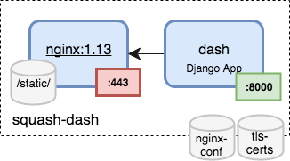

# squash-dash
SQuaSH Dashboard microservice



## Requirements

`squash-dash` microservice requires the [squash-api](https://github.com/lsst-sqre/squash-api), the [squash-bokeh](https://github.com/lsst-sqre/squash-bokeh) microservices and the TLS secrets that are installed by the
[`squash-deployment`](https://github.com/lsst-sqre/squash-deployment) tool.

## Kubernetes deployment

You can provision a Kubernetes cluster in GKE, clone this repo and deploy the `squash-dash` microservice using:

```
TAG=latest make deployment
```

### Debugging

Use the `kubectl logs` command to view the logs of the `nginx` and `dash` containers:

``` 
kubectl logs deployment/squash-api nginx
kubectl logs deployment/squash-api dash
```

Use the `kubectl exec` to run an interactive shell inside a container. Use tab completion or `kubectl get pods` command 
to find the pod's name:


``` 
kubectl exec -it <squash-dash pod> -c dash /bin/bash
```

### Rolling out updates 

Check the update history with:

```
kubectl rollout history deployment squash-dash
```

Modify the `squash-dash` image and then apply the new configuration for the kubernetes deployment:

```
# we need to setup the env for django to collect static files
virtualenv env -p python3
source env/bin/activate
pip install -r requirements.txt
TAG=latest make build push update
```

Check the deployment changes:
```
kubectl describe deployments squash-dash
```

### Scaling up the squash-dash microservice

Use the `kubectl get replicasets` command to view the current set of replicas, and then the `kubectl scale` command 
to scale up the `squash-dash` deployment:

``` 
kubectl scale deployments squash-dash --replicas=3
```

or change the `kubernetes/deployment.yaml` configuration file and apply the new configuration:

```
kubectl apply -f kubernetes/deployment.yaml
```

Check the deployment changes:

``` 
kubectl describe deployments squash-dash
kubectl get pods
kubectl get replicasets
```

## Development 

You can install the dependencies for developing

1. Install the software dependencies
```
git clone  https://github.com/lsst-sqre/squash-dash.git

cd squash-dash

virtualenv env -p python3
source env/bin/activate
pip install -r requirements.txt
```

2. Run the `squash-dash` 

```
python manage.py runserver
```

The `squash-dash` will run at `http://localhost:8000`. 


